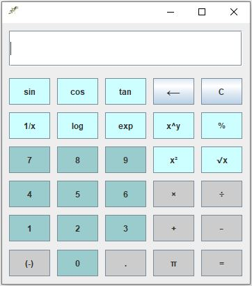

# Java Scientific Calculator

A desktop scientific calculator application developed using Java Swing.

## Overview

This project is a graphical calculator application that provides basic arithmetic operations along with advanced mathematical functions. The application uses Java Swing to create an interactive desktop user interface.

## Features

- Basic arithmetic operations:
  - Addition (+)
  - Subtraction (-)
  - Multiplication (×)
  - Division (÷)

- Scientific operations:
  - Square root (√)
  - Square (x²)
  - Power (x^y)
  - Percentage (%)
  - Reciprocal (1/x)

- Mathematical functions:
  - Sin
  - Cos
  - Tan
  - Logarithm
  - Exponential function

- Additional features:
  - Decimal number support
  - Pi constant
  - Delete last character
  - Clear display

## Technologies

- Java
- Java Swing
- Object-Oriented Programming (OOP)

## Screenshots

## Future Improvements

- Improve input validation and error handling.
- Add calculation history.
- Improve user interface design.
- Add keyboard support.
